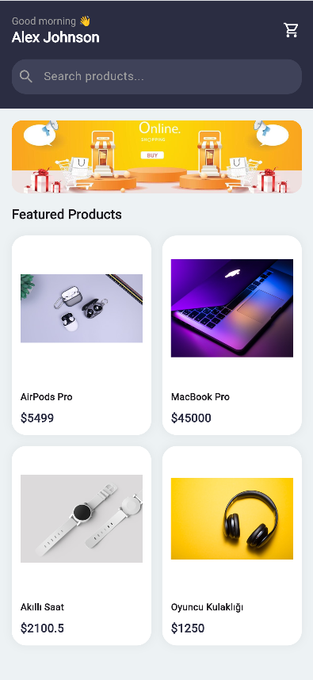
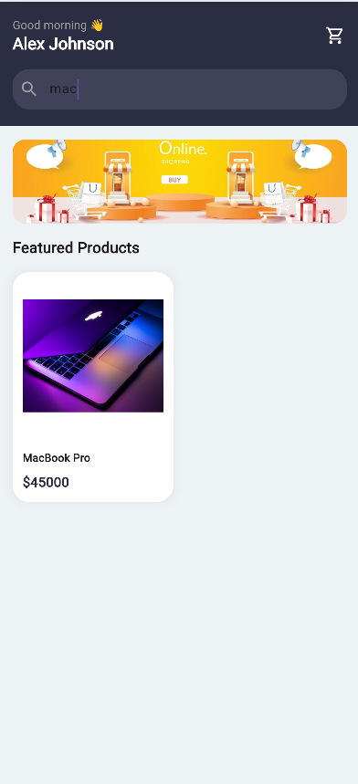
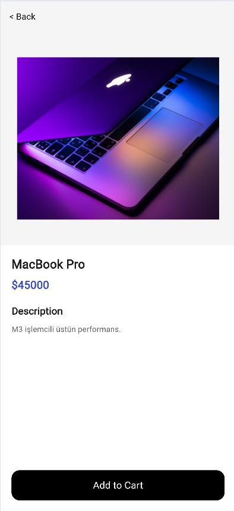
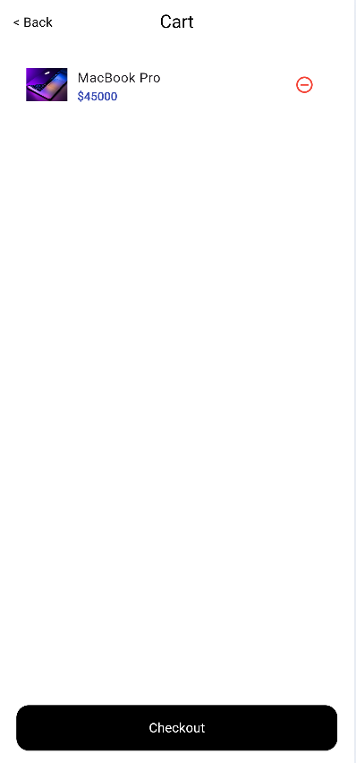

# NovaStore Mini Katalog

Flutter ile geliştirilmiş basit bir mobil e-ticaret katalog uygulaması. Bu proje, Flutter Günlük Eğitimi kapsamında öğrenilen widget yapısı, sayfa geçişleri (Navigator & Route Arguments), temel UI tasarımı, JSON veri modelleme ve state yönetimi konularını uygulamalı olarak göstermek amacıyla geliştirilmiştir.

## Özellikler

- 🏠 **Ana Sayfa**: Arama çubuğu, banner görseli ve GridView ile ürün listesi
- 🔍 **Arama / Filtreleme**: Ürün adına göre anlık filtreleme
- 📦 **Ürün Detay Sayfası**: Route Arguments ile taşınan ürün bilgisi, açıklama ve "Sepete Ekle" aksiyonu
- 🛒 **Sepet Sayfası**: Eklenen ürünlerin listelenmesi, tekil silme ve Checkout (satın alma simülasyonu)
- 📄 **JSON Simülasyonu**: Lokal JSON verisinin `fromJson` ile model nesnesine dönüştürülmesi

## Kullanılan Teknolojiler

- **Flutter SDK**: 3.38.4
- **Dart SDK**: ^3.10.3
- Sadece `material.dart` (ekstra paket kullanılmamıştır)

## Proje Yapısı

```
lib/
├── main.dart                  # Uygulama giriş noktası ve route tanımları
├── models/
│   └── product.dart           # Product modeli ve fromJson dönüşümü
└── screens/
    ├── home_screen.dart        # Ana sayfa, arama ve ürün listesi
    ├── detail_screen.dart      # Ürün detay sayfası
    └── cart_screen.dart        # Sepet sayfası
assets/
└── banner.jpg                  # Ana sayfa banner görseli
```

## Çalıştırma Adımları

1. Bu repository'yi klonlayın:
   ```bash
   git clone <repo-url>
   cd mini_katalog
   ```

2. Bağımlılıkları yükleyin:
   ```bash
   flutter pub get
   ```

3. Bir emülatör başlatın veya fiziksel bir Android cihaz bağlayın.

4. Uygulamayı çalıştırın:
   ```bash
   flutter run
   ```

## Ekran Görüntüleri

| Ana Sayfa | Arama/Filtreleme | Ürün Detayı | Sepet |
|---|---|---|---|
|  |  |  |  |

## Notlar

- Ürün verileri eğitim amaçlı olarak uygulama içinde sabit (lokal) bir JSON metni üzerinden simüle edilmiştir.
- Sepet verisi yalnızca uygulama açıkken hafızada (`Product.cartItems` statik listesi) tutulur, kalıcı değildir.
